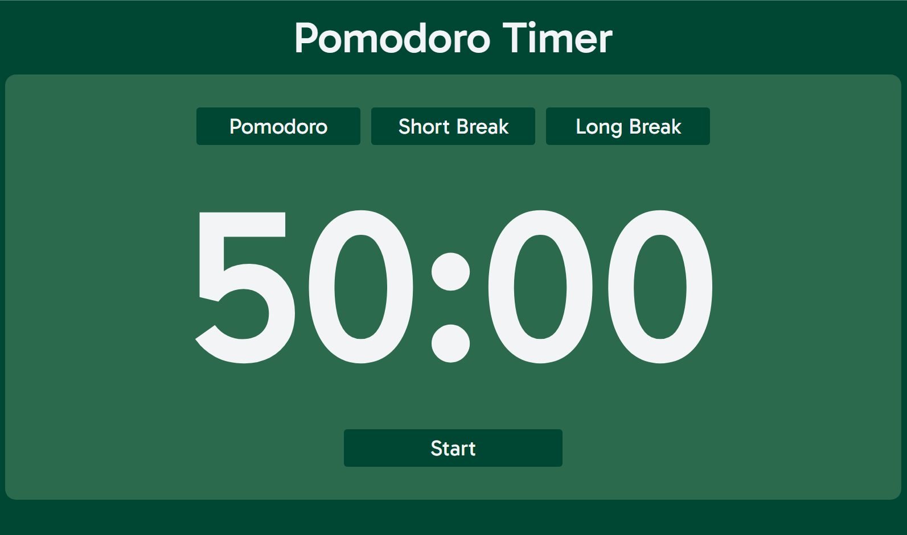

# Pomodoro Timer

Customizable Pomodoro timer website.

Built with HTML, CSS, and JavaScript. Deployed on Github Pages with CI/CD managed by GitHub Actions.

## About

A Pomodoro timer website with customizable durations for pomodoro sessions, short breaks, and long breaks. 

## Usage

Visit the **[Pomodoro Timer](https://siddhp1.github.io/Pomodoro-Timer/)** website. To adjust the durations for pomodoro sessions and breaks, click the gear icon in the top right corner.

## License

This project is licensed under the MIT License. 
